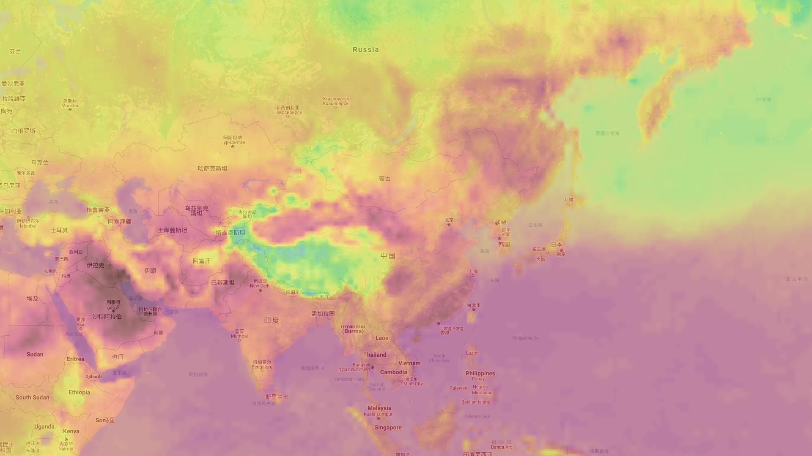

# openlayers 气象可视化 🌈

openlayers 气象要素可视化，做出类似 [Ventusky](https://ventusky.com) 的效果。



## 关于

本项目是基于 vue-cli3 搭建的基础项目，因此不涉及路由处理等请知悉。

## 数据

GFS grib2 数据生成灰度图。如何读取 grib2 文件并生成图片，请参考：[grib2-plot](https://github.com/vensing/grib2-plot)，该项目生成彩色图，生成灰度图只需设置单通道颜色即可。


## 原理

前台读取灰度图数据；获取屏幕坐标转行为经纬度坐标，经纬度坐标经双线性插值获取对应点的气象要素值；通过值找到对应色阶区域的颜色值，canvas 绘制矩形填色。

## 如何运行

```
npm install

npm run serve

```

## 参考

- [Ventusky.com](https://ventusky.com)
- [Windy.com](https://windy.com)
- [earth](https://earth.nullschool.net)
